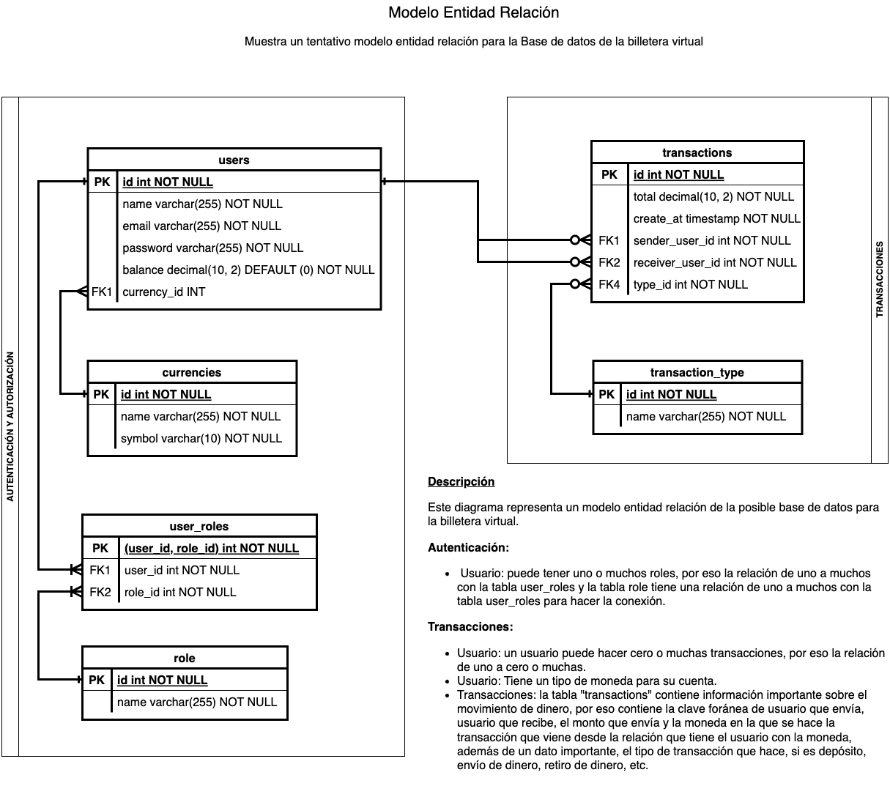

# 👨‍💻 Practicando con SQL y MySQL

Pequeño ejercicio para practicar sentencias simples de SQL usando MySQL como gestor de base de datos y así reforzar
conocimientos en el uso de Bases de Datos relaciones, manipulación y consulta de datos, creación de tablas.

> El [script](script.sql) contiene las sentencias básicas para crear las entidades y relaciones necesarias para el ejercicio.

Las relaciones que se crean quedan expresadas en el siguiente modelo entidad relación, que de igual manera queda respaldado
en el siguiente archivo compatible para la web draw.io [diagrama_er_billetera_virtual.drawio](sources/diagrama_er_billetera_virtual.drawio),
la imágen PNG [diagrama ER de la DB](sources/diagrama_er_billetera_virtual.png) y un archivo PDF del mismo [diagrama ER de la DB](sources/diagrama_er_billetera_virtual.pdf).

